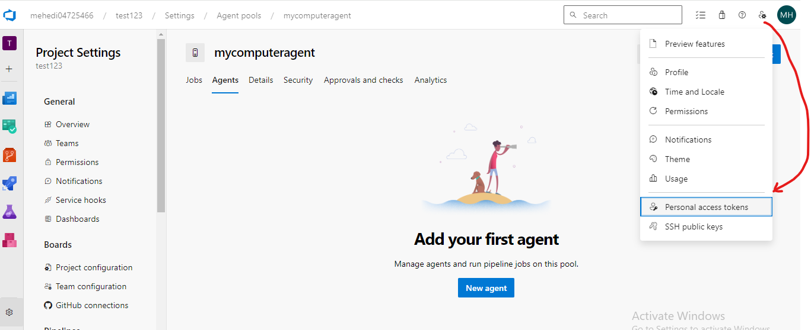
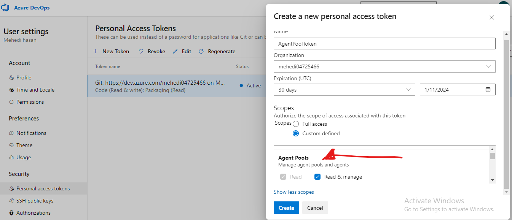
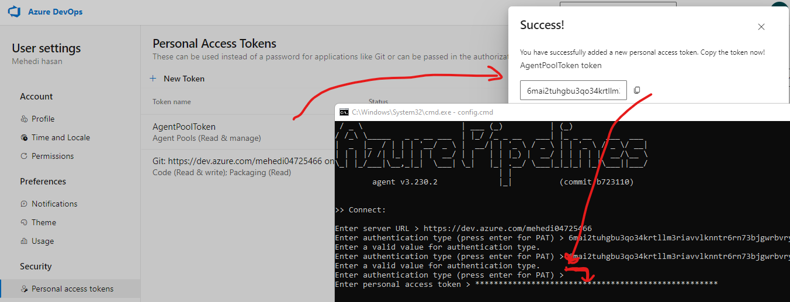
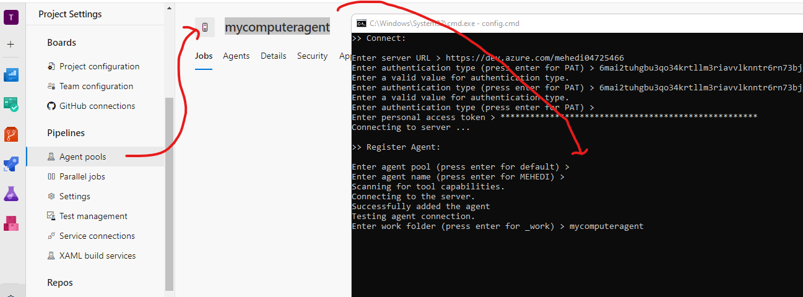
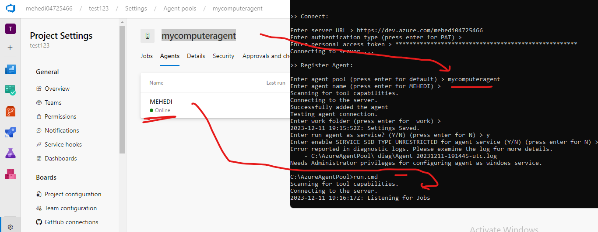
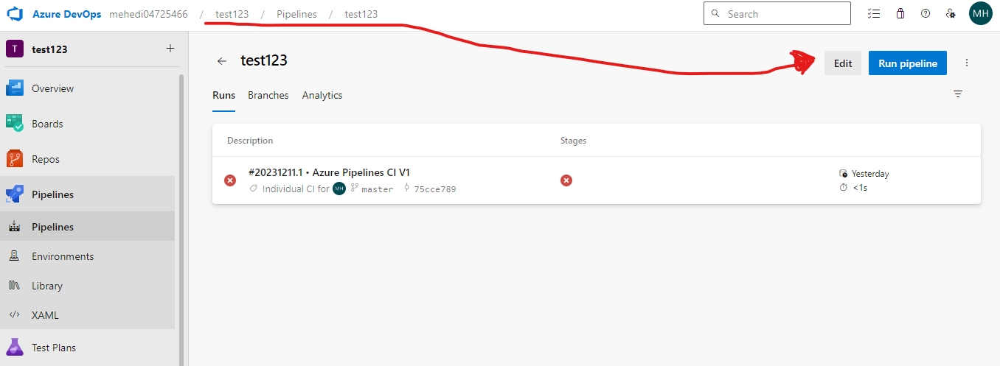
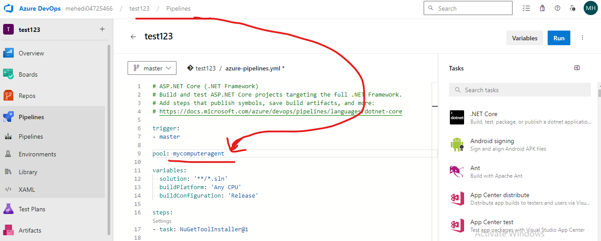
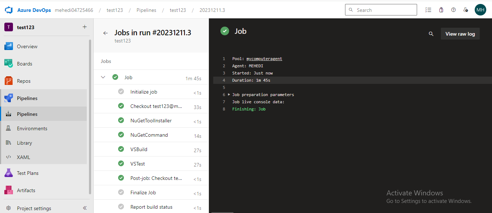

# Creating Pipeline 

-  First Need to understand **Agents** 


- Pipeline means Series of Action/Task can be automated 
-  Test to Go Live this part can be automated (Test, build, publish, UAT server , Go Live (with Permition Email))

- Planing => Execution => Pipeline => Artifacts


### Defining and Understanding Agents in Azure DevOps
#
- To build, test we need machine, CPU 
- Agent is a software which run inside machine and executes the pipeline task.
- Agent execute the task serially 

### Using project settings to configure agents 


- Inside settings => Pipelines => Agetn Pools 


- Hosted Agent => gives by Azure Team
- Hosted Agents and Local agents (Self Hosted agents)


### Creating pipeline and Running the Pipeline 

- Create pipeline 
- Select the Project Repo 


- Select the Project


- Configure the Project Acordingly 


- Review your pipeline YAML
- YAML is a Markup language 
- YAML file and versioning in Azure repos. 
- YAML file where your Pipeline Task are Written 

- Save and Run the YAML file 


```yaml
# ASP.NET Core (.NET Framework)
# Build and test ASP.NET Core projects targeting the full .NET Framework.
# Add steps that publish symbols, save build artifacts, and more:
# https://docs.microsoft.com/azure/devops/pipelines/languages/dotnet-core

trigger:
- master

pool:
  vmImage: 'windows-latest'

variables:
  solution: '**/*.sln'
  buildPlatform: 'Any CPU'
  buildConfiguration: 'Release'

steps:
- task: NuGetToolInstaller@1

- task: NuGetCommand@2
  inputs:
    restoreSolution: '$(solution)'

- task: VSBuild@1
  inputs:
    solution: '$(solution)'
    msbuildArgs: '/p:DeployOnBuild=true /p:WebPublishMethod=Package /p:PackageAsSingleFile=true /p:SkipInvalidConfigurations=true /p:DesktopBuildPackageLocation="$(build.artifactStagingDirectory)\WebApp.zip" /p:DeployIisAppPath="Default Web Site"'
    platform: '$(buildPlatform)'
    configuration: '$(buildConfiguration)'

- task: VSTest@2
  inputs:
    platform: '$(buildPlatform)'
    configuration: '$(buildConfiguration)'

```

- After save it commited to Repor 


- We want to run the job faild 
- Understanding the "No hosted parallelism Error" in Azure DevOps


- We create our own **Agent**
- To solve Parallelism issue 
- Hosted Agent not Free now
- To create New Agent by Own 
- Agent Pools means => Pool of computer
- Add Pool


- Pool Type is Self Hosted (Local machine)


- Agent nothing but a software 
- A software by Download Agnet 


- Extract the download file 

- Configure the agent by 
- PS C:\agent> .\config.cmd







- PAT => Personal Access Token 




- Gives pool name 




- Work folder where run, build, latest file 
- Enter with y 


- Optionally run the agent interactively 
- PS C:\agent> .\run.cmd
- Listien it out of job 


### After Creating local Agent pool 
- Change the YAML file 
- So that YAML file indicate the (our own Agent Pool)




- YAML Edit by  mycomputeragent




- Running YAML pipeline with Self hosted agents 
- Step by Step task execute 





