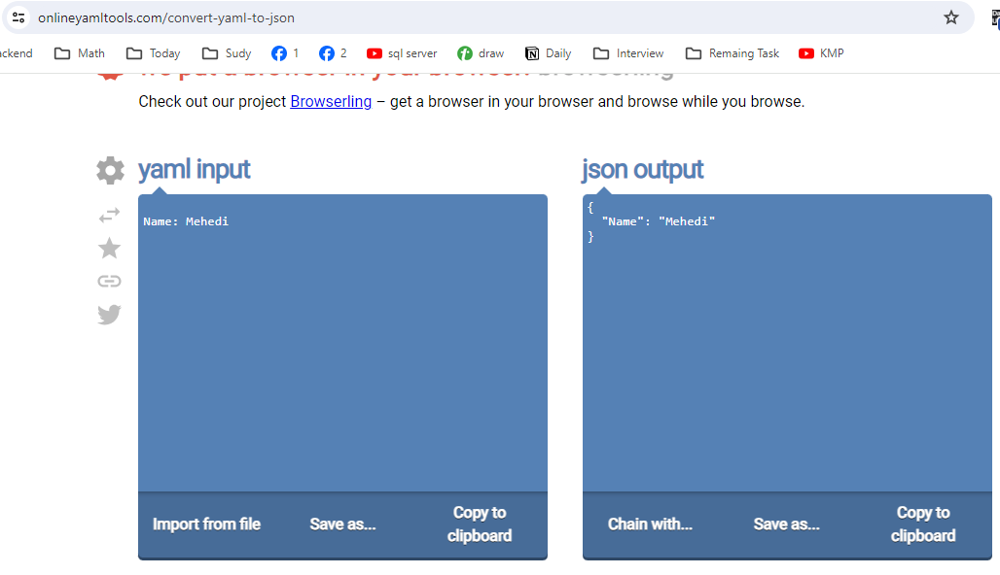
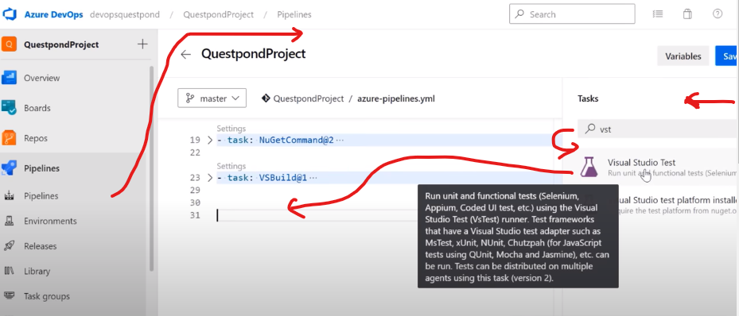

# Definition and Understand Acronym of YAML

- Complete Azure Pipelie written by YAML 

- YAML => Yet Other Markup Language 
- YAML => Ain't Markup Language 

### some words 
- Its not like HTML
- Its not meant for documents.
- Its not meant for look and feel.
- Its not meant for positioning 

- YAML is a data serialization format for storing **configuration information**

#
## YAML basic name / value, space, indented, Nested objects & Hyphens 

- Practice YAML to json comverter 
https://onlineyamltools.com/convert-yaml-to-json

- Yaml Name: value 

- Space Indentation **not Tab** is important See Example 

- Hyphane **-** Represent the collection 

- Nested Object 

- Azure Generated code of YAML Understand 

- When some Push code into master This YAML Triger 
- pool Machine In our case mycomputeragetn
- It as some variables
- Step of **task** it should perform (Install NuGet => NwGetCommand => Build => Test)

- How to Assign Task Into YAML 
- The task Azure Team assign 
- We Set Into YAML file This way : 

