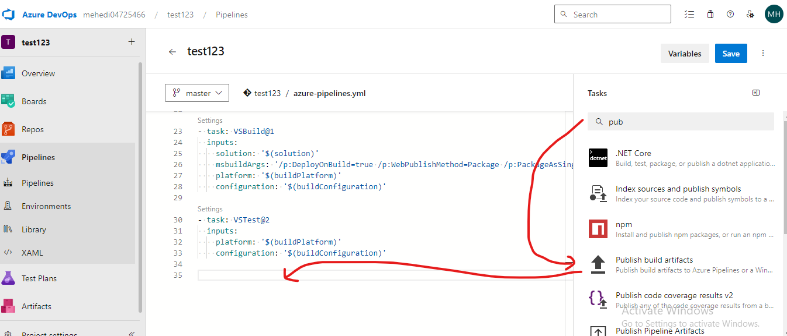
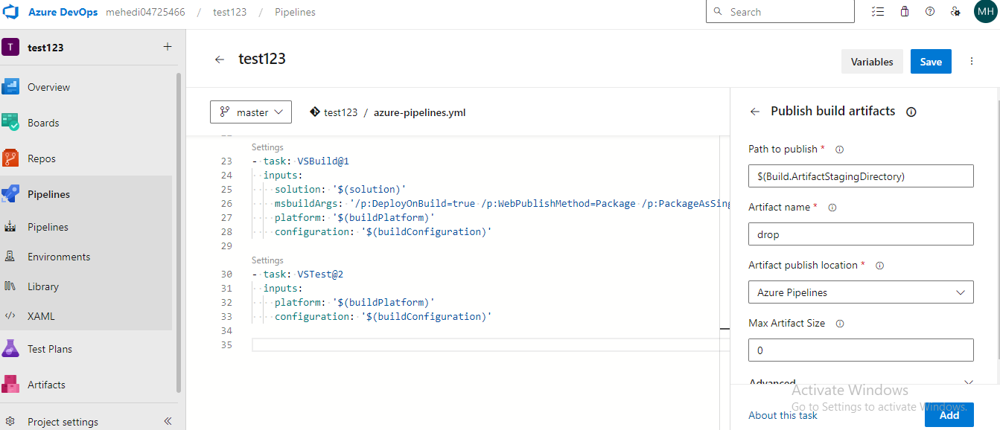
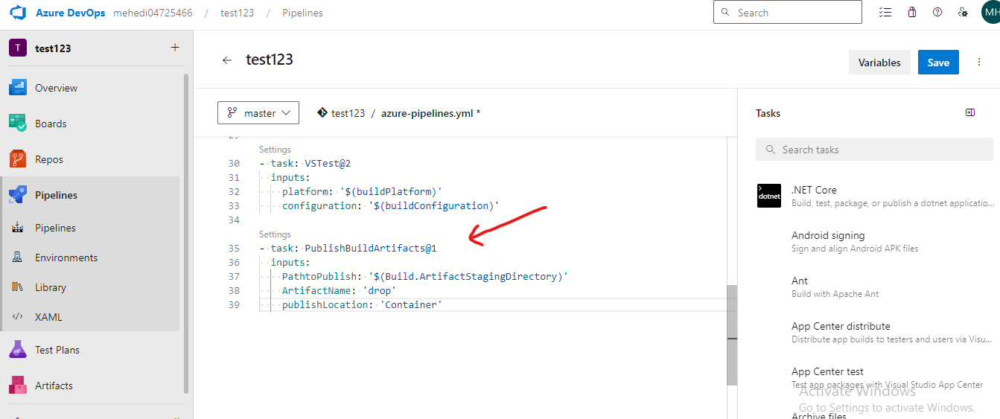
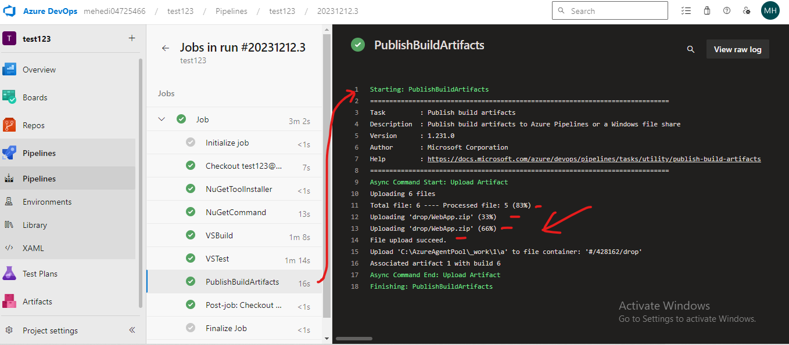
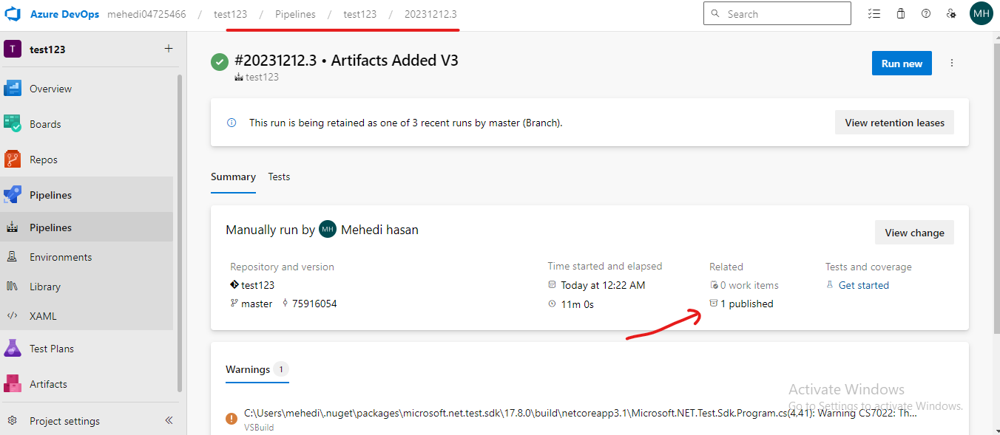
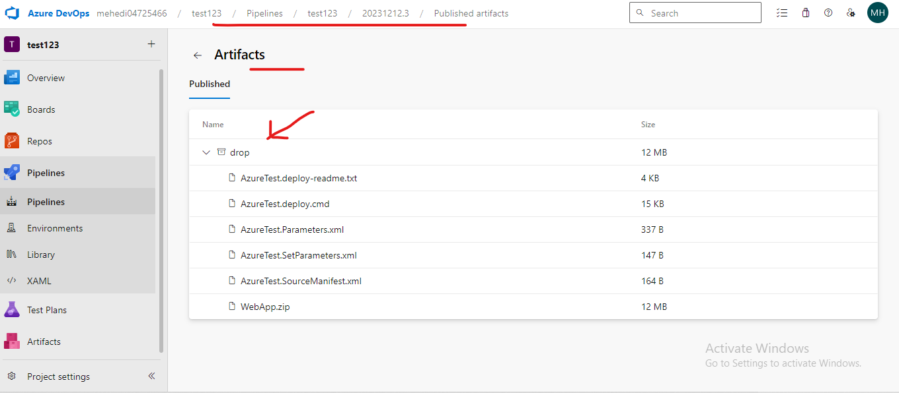

# Understand Artifacts 

- After Create Agents
- YAML file 
- Update YAML file 
- by Adding Artifacts Task 
- Affter Getting Artifacts 
- Go Life Starts 
- After Test We Add Artifacts To **WebApp.zip** into YAML file 

- Running the pipeline and checking the Artifact

- Publish Artifacts 

- Go inside the Publish We see the Drop folder 
- Our build and Deployment file is there 

- This **WebApp.Zip** folder and Put into **IIS** To Go Live 

