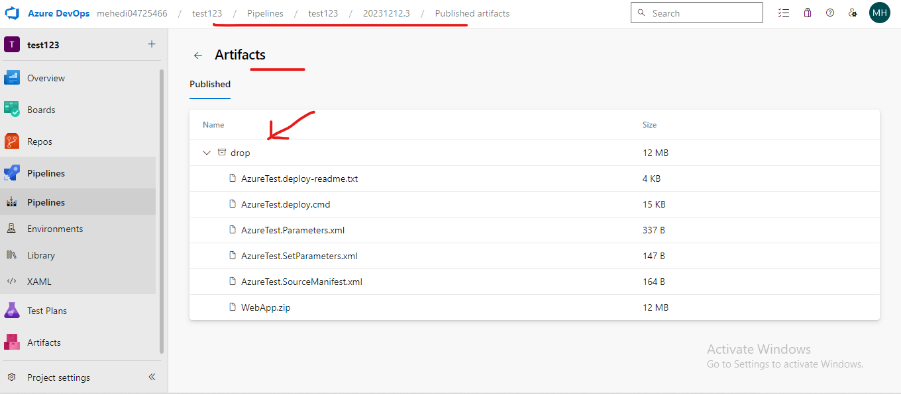

# This **WebApp.Zip** folder and Put into **IIS** To Go Live 

- WebApp.zip get From Artifacts Means 
- Run the Pipeline and Get Artifacts Finally 
- That Artifacts Now WebApp.Zip contains 

- Download or Make Automated pushlish This the Guidline 

