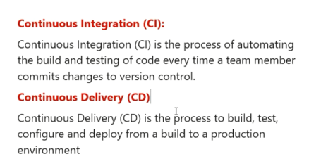
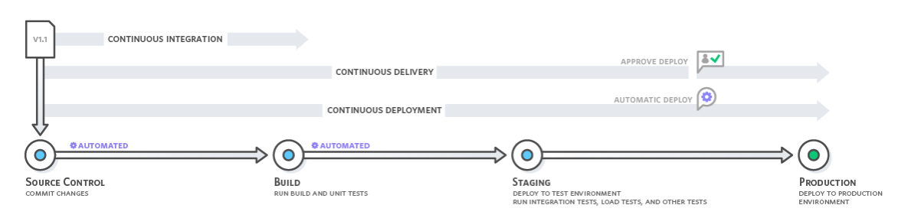
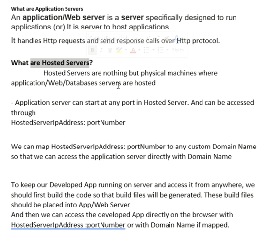

# Deployment Basics_What are CI_CD Pipelines

- Classic Diagram is available to explain these terms in below AWS Website 

https://aws.amazon.com/devops/continuous-integration/

## Continuous Integration Explained

Continuous integration is a DevOps software development practice where developers regularly merge their code changes into a central repository, after which automated builds and tests are run. Continuous integration most often refers to the build or integration stage of the software release process and entails both an automation component (e.g. a CI or build service) and a cultural component (e.g. learning to integrate frequently). The key goals of continuous integration are to find and address bugs quicker, improve software quality, and reduce the time it takes to validate and release new software updates.

## Why is Continuous Integration Needed?
In the past, developers on a team might work in isolation for an extended period of time and only merge their changes to the master branch once their work was completed. This made merging code changes difficult and time-consuming, and also resulted in bugs accumulating for a long time without correction. These factors made it harder to deliver updates to customers quickly.

## How does Continuous Integration Work?
With continuous integration, developers frequently commit to a shared repository using a version control system such as Git. Prior to each commit, developers may choose to run local unit tests on their code as an extra verification layer before integrating. A continuous integration service automatically builds and runs unit tests on the new code changes to immediately surface any errors.

Continuous integration refers to the build and unit testing stages of the software release process. Every revision that is committed triggers an automated build and test.
 
With continuous delivery, code changes are automatically built, tested, and prepared for a release to production. Continuous delivery expands upon continuous integration by deploying all code changes to a testing environment and/or a production environment after the build stage.

# Deployement Basic 

- Host code into Web/Applicaton server Note: (application server is pice of software)
- This server request and response by Http protocal 
- For this our web application comunicate through the internet 

 

- Hosted nothing but a physical machine 
- It has IP address by this we identity machine 
- In our sofwere Run in Port Number 
- by this **IP:port** we exatly get comunicate =>  Request and Response

