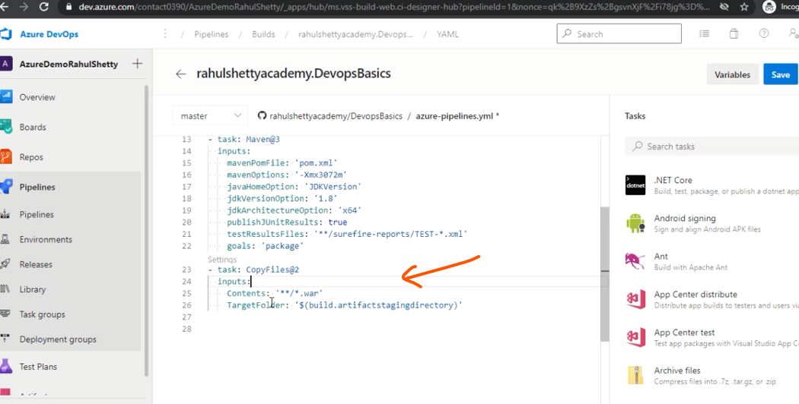
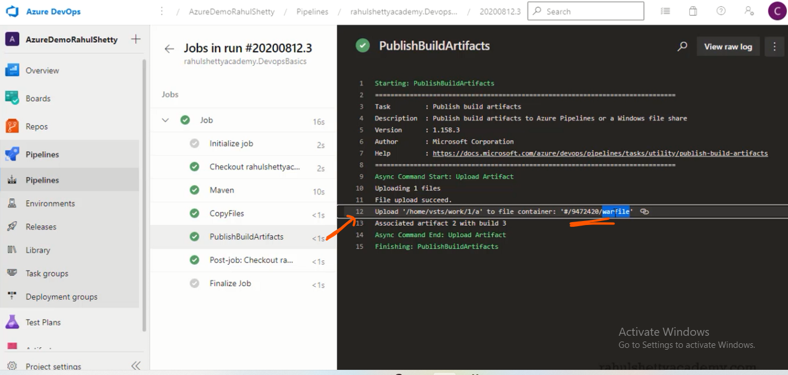

# Setting up Build CI_CD Pipelines for Projects  

- different Pipeline are Azure Pipelines

- Create Pipeline 

- Select Repository 

- Configure you Pipeline 

- Review you YAML file 
- **Pool** means a machine where it has CPU, Ram, memory so that it can build the project 

- Run the project 

# 

- To Get of the build project war copy to s1 to a folder of _work direactory  

- To Added into  Pipeline 

- To Add this Artifact into Build publish 

- After run the YAML file we get Artifacts

- Publish build Artifacts War file place into Unique #Id

# 
### CI => Continous Integratoin Happening How
- When you push code into master branch 
- Autometicaly build Pipeline Triger 
- You have to Mention What is the condition for Trigger 

