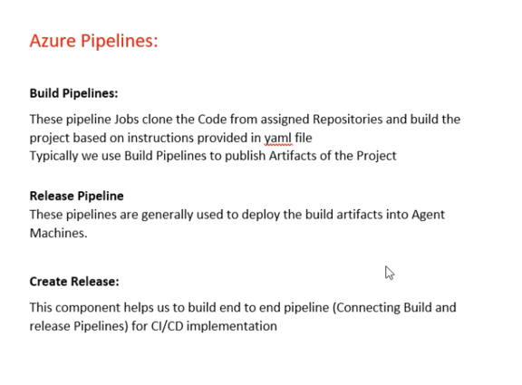
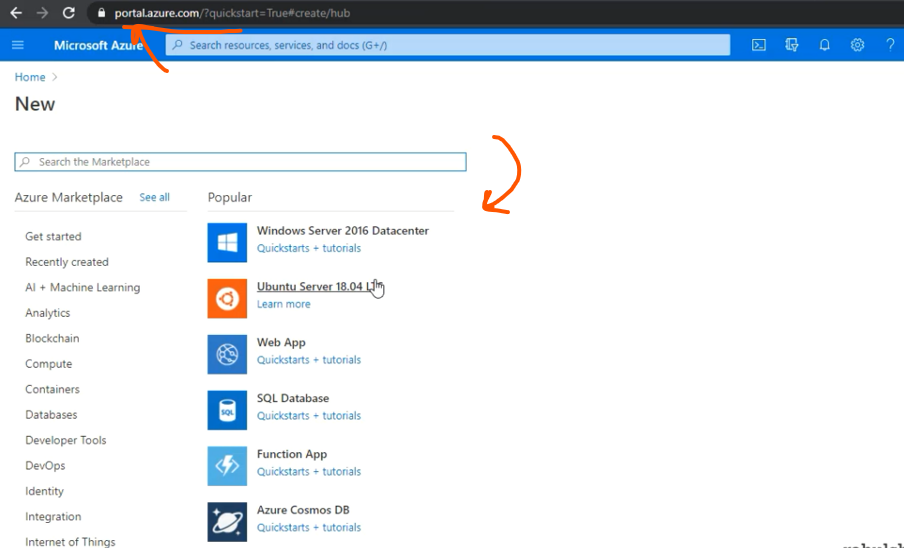
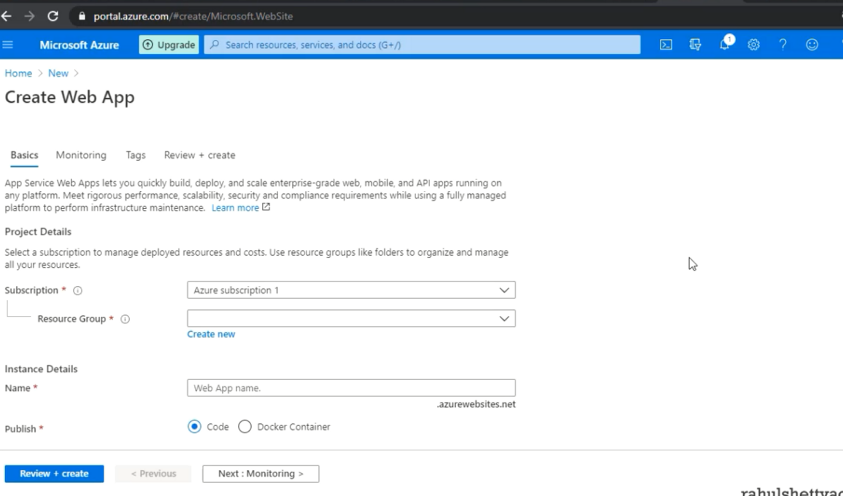
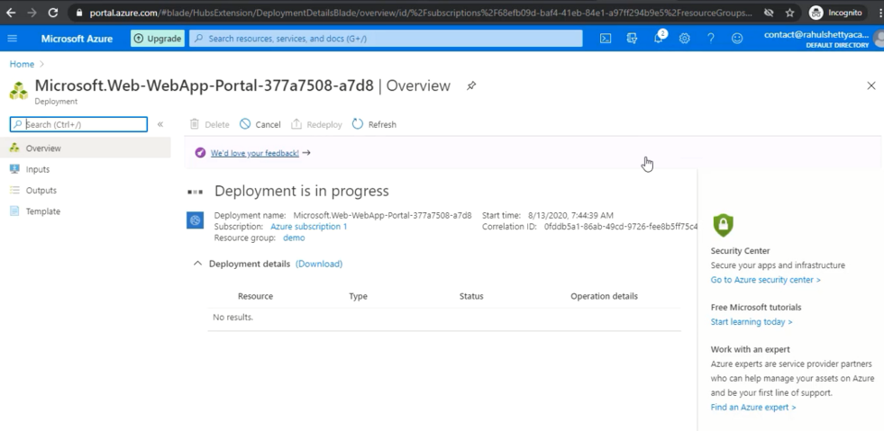
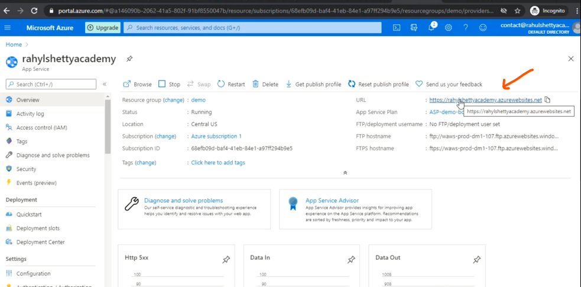
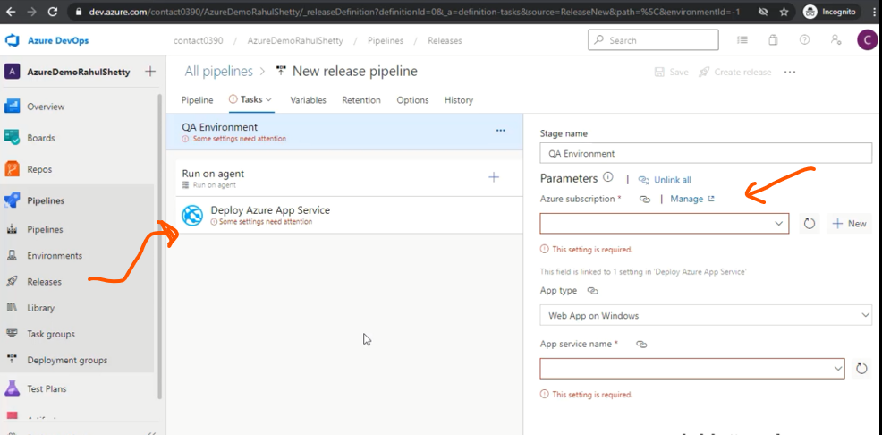
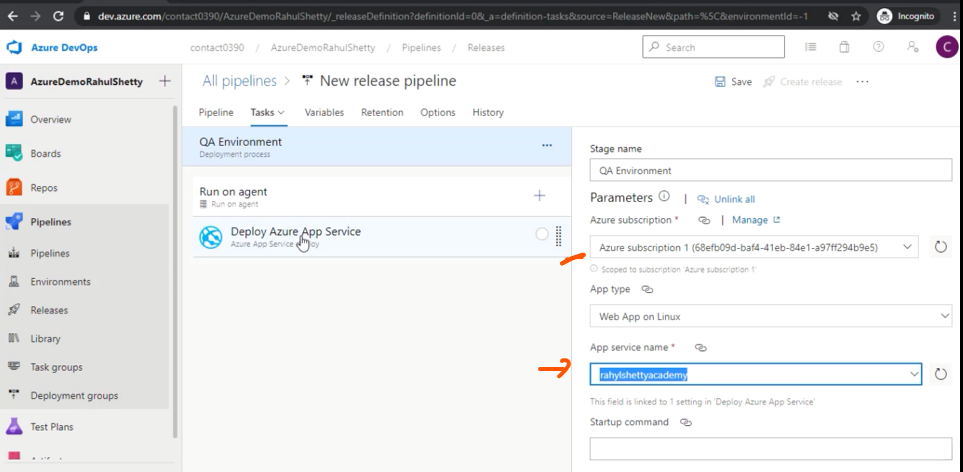

#  Setting up Release CI_CD Pipelines for Projects using Azure

- Creating Release pipeline 
- We need a machine 
- We go to Azure Portal and create machine as Resource 

- Instated of full pc we create a We APP only Azure all take creae of

- Linux server create for you 

- Resource URL created Where we deploye our code 

- Give the resource URL into this Link 

- Deployee our project into this servise 

