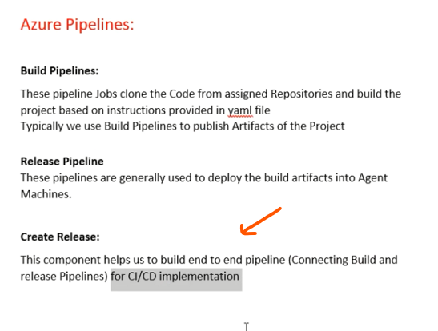
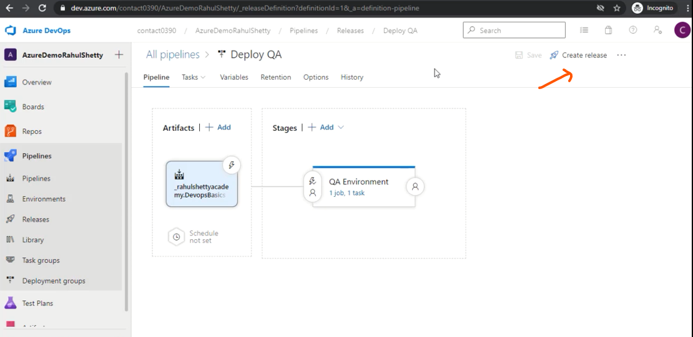
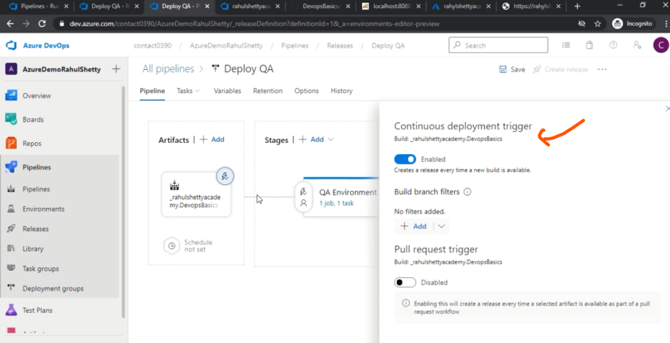
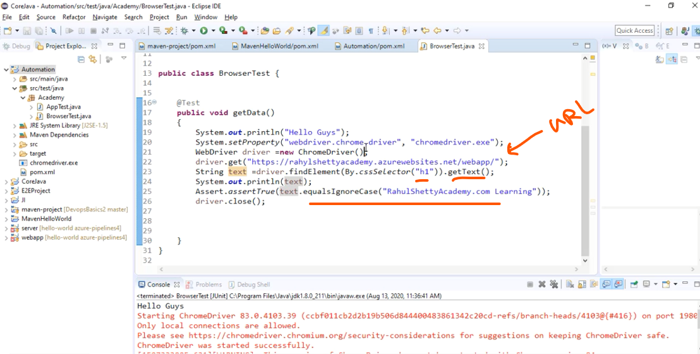

# 05 - Introduction to Azure Repositories and Release components

- Create Release 
- Get Artifacts and push into QA Environment  

- When New push master branch (CI)
- New Artifact created 
- Enable for New Release also trigered (CD) 
- CD are used any Cloud Like Azure in our case 

- After publish Into QA env 
- We pass some test case 
- Then Test pass It publish into Production ENV

 