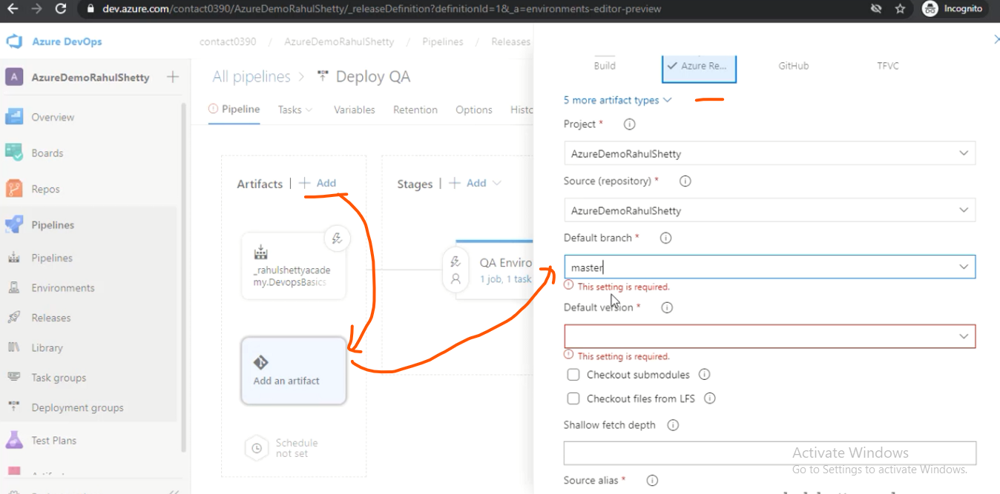

# 06 - Adding Test Automation Jobs to the Release Pipelines

- Our Test Present Repository 
- Now we want a Test Created In our Deployeement 

 

- New Artifactes Added for Testing 

 

- From artifactes added into our Release Pipeline 

- After Test case done 
- Then we add into our Production 
- One is QA env Other machine consider as Production machine Afte test successful then we deployee it Production 

