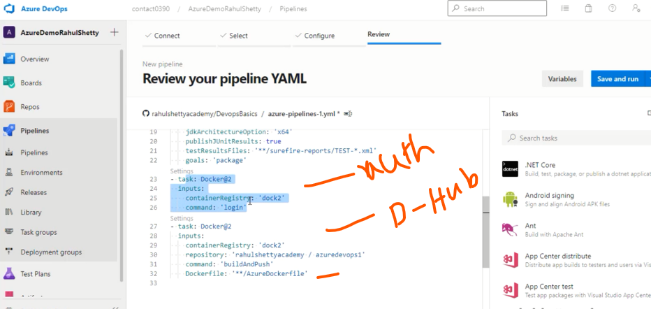

# 07 - Docker Hub Integration with Azure Dev Pipelines

- Docker image how we can Dockerize the code repositories 

 

### General 
- Let's say we have a Maven Project 
- After build we get a War file 
- That file Deploye any machine which is runing Tomact server for (Request, Response) of the project Live

### Docker Image 
- War file -> Deployee Tomcat -> Make docker Image  
- Find any machine and then start Docker container (Image)

### Docker Hub 
- is Open Platform where we can Upload/Download docker Images 
- Any one can Download and Run this Image in any machine 

 

### Create New Pipeline 

- Select Docker this time 

 

- Or Another Way 
- After Build It create Docker Image (YAML instruction)

 
 

